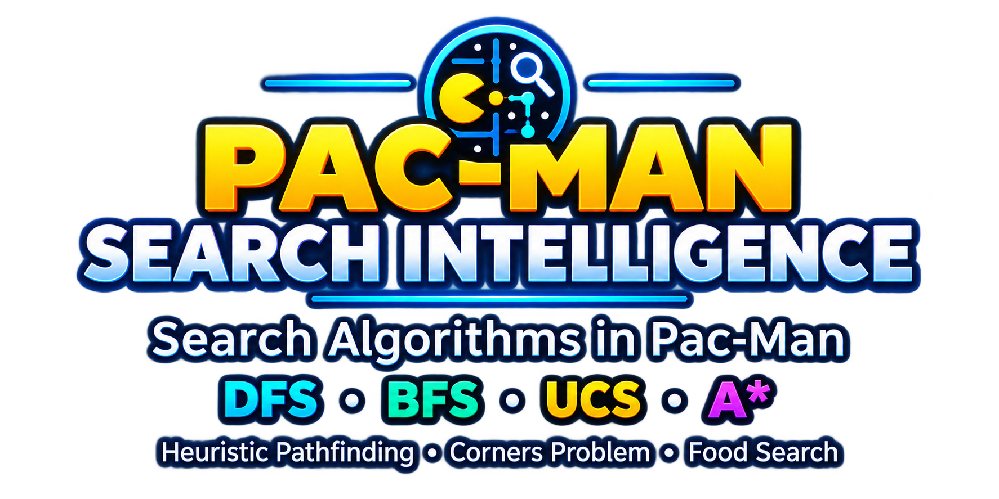

# Pac-Man Search Intelligence

A Python search assignment for **IT3012 — Intelligent Agents**, built on the
supplied UC Berkeley Pac-Man framework. The project explores depth-first search,
breadth-first search, uniform-cost search and A*, then applies search states and
heuristics to visiting all four corners and collecting food.

**Development status:** the current source still contains the Q1–Q7 starter
implementations. The generic search functions and corner state methods need
implementation, and the supplied corner and food heuristics are placeholders.
Full-score grading is manual while this work is in progress.

[Getting started](#getting-started) · [Search examples](#search-examples) ·
[Testing](#testing) · [Source boundaries](#source-boundaries) ·
[GitHub workflows](#github-workflows) · [Contribution and submission](#contribution-and-submission)

## Project scope

The assignment covers **Q1–Q7**. Q8 exists in the supplied framework but is outside
the required scope unless separately requested. The Project Guidelines PDF
governs assessment; repository automation preserves the supplied source and
supports verification.

| Question | Topic | Implementation location |
| --- | --- | --- |
| Q1 | Depth-first search (DFS) | `src/search.py` → `depthFirstSearch` |
| Q2 | Breadth-first search (BFS) | `src/search.py` → `breadthFirstSearch` |
| Q3 | Uniform-cost search (UCS) | `src/search.py` → `uniformCostSearch` |
| Q4 | A* search | `src/search.py` → `aStarSearch` |
| Q5 | State representation and successors for visiting four corners | `src/searchAgents.py` → `CornersProblem` |
| Q6 | Corner-search heuristic | `src/searchAgents.py` → `cornersHeuristic` |
| Q7 | Food-search heuristic | `src/searchAgents.py` → `foodHeuristic` |

Implementations must preserve the supplied interfaces and use the provided
`util.Stack`, `util.Queue` and `util.PriorityQueue` fringe structures. Heuristics
must satisfy the assignment's correctness and performance requirements.

## Repository layout

```text
Pac-Man-Search-Intelligence/
├── README.md                  # Project overview and usage
├── AGENTS.md                  # Repository-wide agent instructions
├── assets/
│   └── pacman-search-intelligence-logo.png
├── .agents/                   # Assignment rules, skills and source recovery
├── .github/                   # Workflows, source policy and CI helpers
└── src/                       # Supplied Pac-Man project
    ├── search.py              # Q1–Q4 implementation file
    ├── searchAgents.py        # Q5–Q7 implementation file
    ├── pacman.py              # Game entry point
    ├── util.py                # Supplied search data structures
    ├── autograder.py          # Supplied grading entry point
    ├── layouts/              # Maze layouts
    └── test_cases/            # Supplied questions and expected results
```

Run Pac-Man and autograder commands from **`src/`**. Run repository checks from
the repository root. The source tree contains additional supplied game,
display, agent and grading modules beyond those shown above.

## Getting started

You need Git and Python **3.9–3.11**. The assignment environment uses Conda with
Python **3.11**, `numpy` and `matplotlib`. See the official
[Conda environment guide](https://docs.conda.io/projects/conda/en/stable/user-guide/tasks/manage-environments.html)
for installation-independent environment commands.

```sh
git clone https://github.com/WKS2004/Pac-Man-Search-Intelligence.git
cd Pac-Man-Search-Intelligence

conda create -n cs188 python=3.11
conda activate cs188
conda install numpy matplotlib

cd src
```

Keep the environment outside `src/`. All Python examples use `-B` to prevent
bytecode files from being generated in the protected source tree.

### Run the supplied starter demo

```sh
python -B pacman.py -l tinyMaze -p SearchAgent -a fn=tinyMazeSearch -t
```

This uses the supplied fixed path for `tinyMaze`, so it can run before DFS or BFS
is implemented. It demonstrates the game setup, not a general search solution.
The `-t` option uses text output without a graphical window.

For keyboard play on a machine with a working graphical display and Tk support:

```sh
python -B pacman.py -l mediumClassic
```

Keyboard control requires graphics; it cannot be combined with text-only play.

## Search examples

Run these from `src/` **after implementing the corresponding questions**. They
are usage examples, not claims that the current starter passes them.

```sh
# Q1: depth-first search
python -B pacman.py -l mediumMaze -p SearchAgent -a fn=dfs -t

# Q2: breadth-first search
python -B pacman.py -l mediumMaze -p SearchAgent -a fn=bfs -t

# Q3: uniform-cost search
python -B pacman.py -l mediumMaze -p SearchAgent -a fn=ucs -t

# Q4: A* with the supplied Manhattan-distance heuristic
python -B pacman.py -l mediumMaze -p SearchAgent -a fn=astar,heuristic=manhattanHeuristic -t

# Q5: visit all corners using BFS
python -B pacman.py -l tinyCorners -p SearchAgent -a fn=bfs,prob=CornersProblem -t

# Q6: A* using the corner heuristic
python -B pacman.py -l mediumCorners -p AStarCornersAgent -t

# Q7: A* using the food heuristic
python -B pacman.py -l smallSearch -p AStarFoodSearchAgent -t
```

Use the reported path cost, nodes expanded and grading results to evaluate each
implementation. Finding a legal path alone does not establish optimality or
heuristic correctness.

## Testing

Use the supplied tests unchanged. From `src/`, run assessed questions separately
to avoid including Q8 in an unrestricted full-grader run:

```sh
python -B autograder.py -q q1 --no-graphics
python -B autograder.py -q q2 --no-graphics
python -B autograder.py -q q3 --no-graphics
python -B autograder.py -q q4 --no-graphics
python -B autograder.py -q q5 --no-graphics
python -B autograder.py -q q6 --no-graphics
python -B autograder.py -q q7 --no-graphics
```

Read the actual scores and dependency messages: a successful process exit code
does not necessarily mean the supplied grader awarded full points. Its raw
points differ from the PDF's assignment marks; do not treat them as interchangeable.

From the repository root, validate the source boundary and agent resources:

```sh
python -B .github/scripts/check_source_boundary.py
python -B .agents/scripts/validate_agent_resources.py
```

For diagnostic artifacts, workflow policy tests and CI helper checks, see the
[GitHub automation guide](.github/AUTOMATION.md). Keep all generated reports, caches,
recordings and other outputs outside `src/`.

## Source boundaries

**Only the contents of the existing `src/search.py` and `src/searchAgents.py`
may be edited for authorized assignment implementation.**

- Every other file under `src/`, including nested and untracked files, is read-only.
- Do not create, delete, rename or move source files, including the two allowed files.
- Preserve the supplied framework, tests, expected solutions, layouts, function
  signatures, licensing notices and grader expectations.
- Do not change grading thresholds or tests to make an implementation pass.
- Agent implementation requires explicit user authorization. Documentation,
  workflows and agent resources do not grant it.

Agents must snapshot `src/` before work, check it after operations and restore
their own verified unauthorized changes to the pre-task state. Recovery must
preserve existing and concurrent user edits. The procedure is documented in
[change-safety](.agents/rules/change-safety.md#mandatory-rejection-and-recovery).

Start agent-assisted work with [AGENTS.md](AGENTS.md), then follow
[task routing](.agents/routing.md). The [agent resource guide](.agents/README.md)
describes the available rules and skills.

## GitHub workflows

| Workflow | Runs when | Purpose |
| --- | --- | --- |
| [Branch Name Policy](.github/workflows/branch-policy.yml) | Branch creation, pushes, PR updates or manual audit | Reject uppercase branch names and attempt to delete invalid branches in this repository |
| [Protected Source Policy](.github/workflows/protected-source.yml) | A PR targeting `main` is opened, reopened or updated | Automatically close PRs whose current source tree violates the source boundary |
| [Repository Checks](.github/workflows/repository-ci.yml) | Pushes, PRs or manual runs | Check source integrity, syntax, agent resources, CI helpers and workflow definitions |
| [Pac-Man Search Tests](.github/workflows/search-tests.yml) | Manual runs only | Grade Q1–Q7 on Python 3.9, 3.10 and 3.11 and upload diagnostic artifacts |

Search grading is one workflow with three Python-version jobs. Run it through
**Actions → Pac-Man Search Tests → Run workflow** and choose the branch to grade.
Incomplete implementations still fail manual grading; routine pushes do not
trigger it while the assignment is in progress.

Protected Source Policy compares the PR's current source tree with a fixed
reviewed baseline. It rejects protected content edits, additions, deletions,
renames, permission changes and file-type replacements. It does not inspect
every historical commit or restore PR files. A direct push to `main` has no PR
to close; preventing direct pushes requires GitHub branch protection.

These workflows depend on GitHub Actions permissions. Fork branch deletion and
protected branch deletion have platform limits. See the
[automation guide](.github/AUTOMATION.md) for enforcement details and required-check
configuration. Manual grading jobs should not be required PR checks.

## Contribution and submission

Use entirely lowercase branch names, for example `feature/q1-dfs`,
`fix/corners-heuristic` or `docs/readme`. Keep changes focused and record meaningful
commits that reflect each contributor's actual work. Include the tested question,
score, path cost or expansion count where relevant when describing a change.

The group report must describe the implementation and genuine contributions,
include actual grading evidence, and declare AI tools with the **exact prompts**
used. Each member should understand the full solution for individual evaluation.

The submission consists of two separate items:

- `Group_<ID>_Report.pdf` — the group report, using the actual group ID.
- `Group_<ID>_Code.zip` — only `search.py` and `searchAgents.py` at the ZIP root,
  taken from `src/`; no framework, tests, layouts or repository documentation.

Consult the Project Guidelines PDF and the
[report and submission guidance](.agents/rules/report-submission.md) for the full
requirements. Preserve all original source notices when preparing submission files.

## Attribution and educational use

The Pac-Man framework and autograder were developed at **UC Berkeley**. The
supplied notices credit John DeNero and Dan Klein for the core projects and
autograders, and Brad Miller, Nick Hay and Pieter Abbeel for student-side grading.
See [UC Berkeley](https://ai.berkeley.edu/) and the
[CS188 search project reference](https://inst.eecs.berkeley.edu/~cs188/archive/fa24/projects/proj1/).

The supplied source permits educational use under its existing terms, including
retaining attribution and not distributing or publishing solutions. The local
assignment's public-repository requirement conflicts with that publication
restriction; obtain instructor clarification before publishing completed solutions.
The Project Guidelines PDF governs this assignment's scope rather than another
semester's CS188 project page. No additional project license is declared here.
